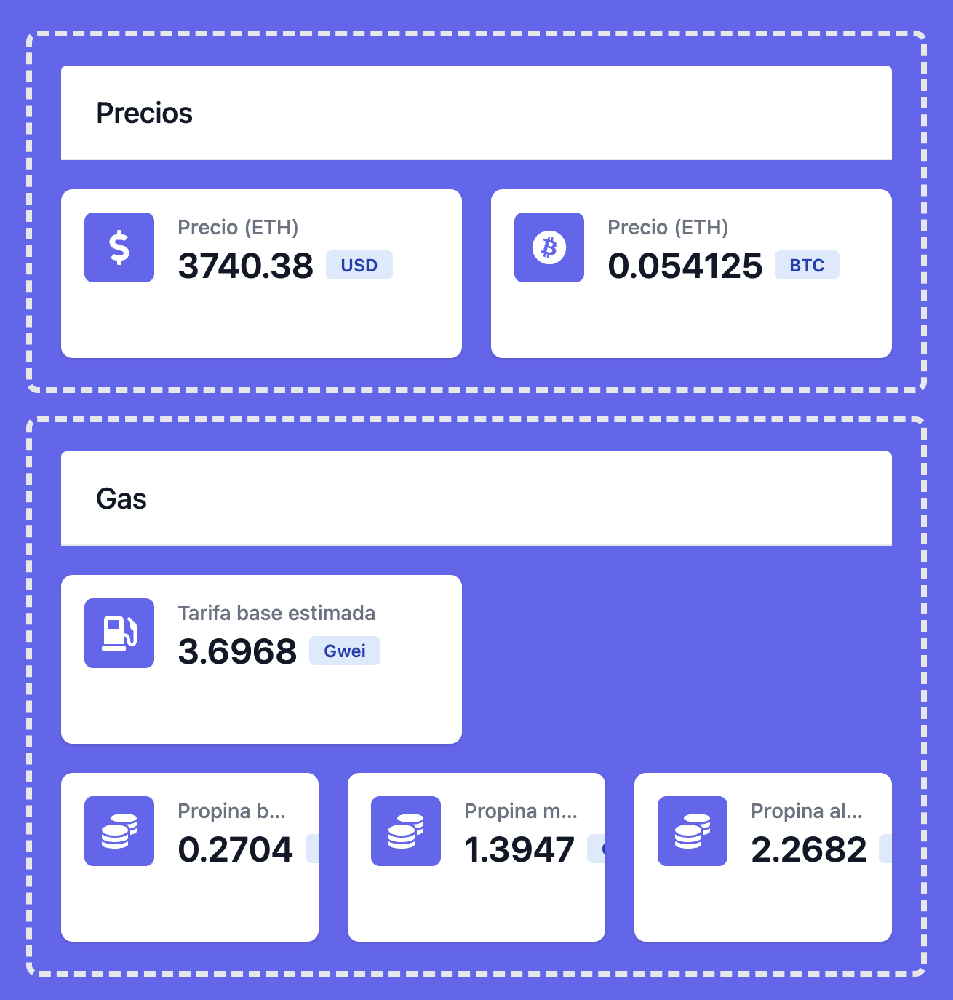
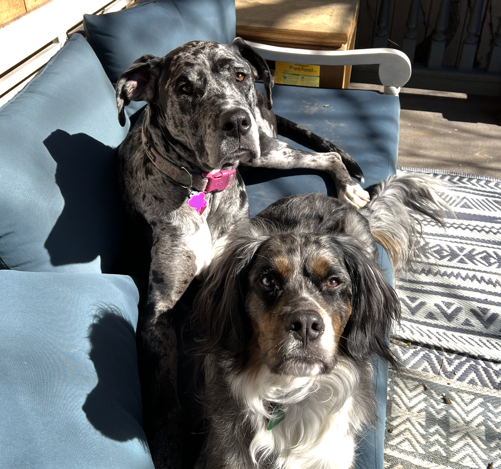
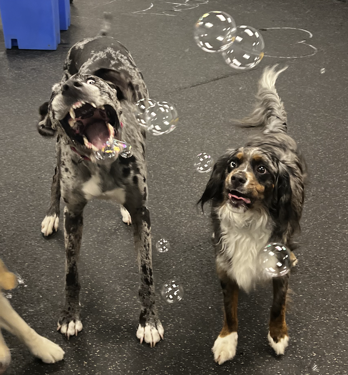

+++
title = 'About'
date = 2024-05-25T07:07:07+01:00
+++

## Intro

Hi, I'm Juan, a software engineer who loves working
on backend systems. I mostly work using Go, Postgresql and
Kafka but I enjoy exploring new technologies, especially
those that simplify solutions for whatever problem
I’m trying to tackle at the moment. Originally from Caracas, Venezuela,
I'm now a US citizen who's always up for learning new things.

## Projects

- [NIStudies](https://nistudies.com) fMRI neuroimaging studies explorer. Built with using [FastAPI](https://fastapi.tiangolo.com/) and [NextJS](https://nextjs.org/).
  

- [ETHEsp](https://ethesp.com) small blog and dashboard discussing Ethereum concepts in Spanish. Built with [NextJS](https://nextjs.org/).
  

- [SFDCClient](https://github.com/nicheinc/sfdcclient) golang package consisting of a wrapper of an HTTP client,
  for making requests to salesforce's REST API through a connected app,
  making use of the [Salesforce OAuth 2.0 JWT Bearer Flow for Server-to-Server](https://help.salesforce.com/articleView?id=remoteaccess_oauth_jwt_flow.htm&type=5)
  authorization flow.

## Dogs

