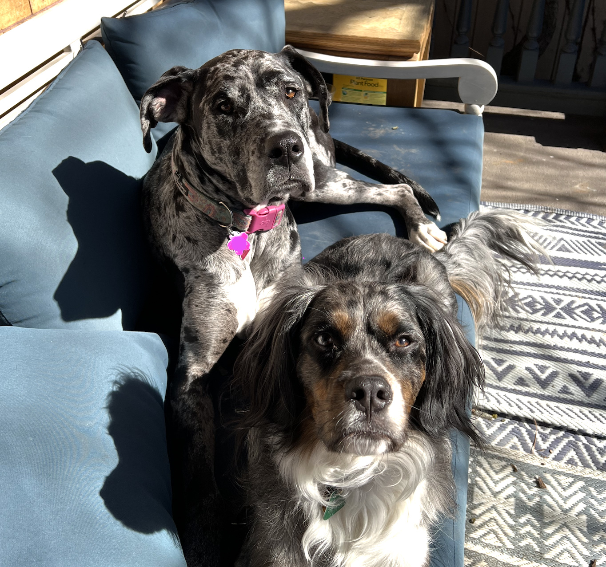
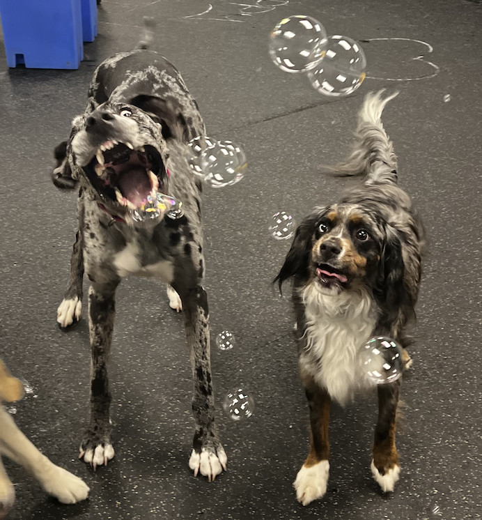

+++
title = 'About'
date = 2024-05-25T07:07:07+01:00
+++

## Intro

Hi, I'm Juan, a software engineer focused on building backend systems and distributed applications. I primarily work with Go, PostgreSQL, and Kafka, and I enjoy designing reliable, scalable software that solves real-world problems. I'm always interested in learning new technologies and choosing the right tools to build simple, effective solutions.

## Projects

### [NIStudies](https://nistudies.com)

A web platform for exploring and analyzing functional MRI (fMRI) research studies. NIStudies helps researchers and students discover, browse, and better understand publicly available neuroimaging datasets.

  FastAPI
  NextJS
  Python
  React

### [SFDCClient](https://github.com/nicheinc/sfdcclient)

An open source Go package that simplifies communication with the Salesforce REST API. It provides an HTTP client wrapper with built-in support for the Salesforce OAuth 2.0 JWT Bearer Flow, enabling secure server-to-server authentication through Connected Apps.

  Go
  Salesforce API
  OAuth 2.0
  REST

## Dogs

